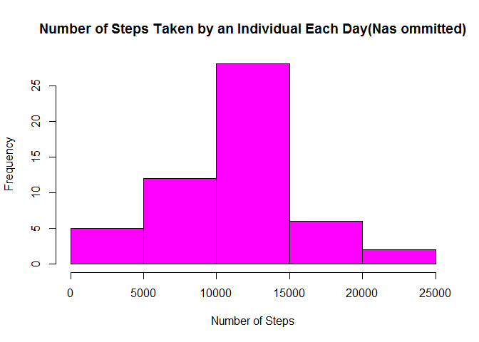

Study of the Number of Steps Taken by An Individual
====================================================

It is now possible to collect a large number of dat about personal movement using activy monitoring devices like Fitbit, Nike Fuelband, or Jawbone Up. Thes types of devices are part of the "quantified self" movement- a group of enthusiasts who take measurements about themselves regularly to improve health, to find patterns in behavior, of because they are tech geeks. But thess data remain under utilized both because the raw data are hard to obtain and there is a lack of statistical methods and software for processing and interpreting the data.  

This document will us data from a personal moitoring device.  The data was collected at 5 minute intervals throughout the day and consists of data from 2 months: October and November, 2012. The number of steps taken in 5 minute intervals each day.

The raw data can be found through the following link: [Activity Monitoring Data](https://d396qusza40orc.cloudfront.net/repdata%2Fdata%2Factivity.zip)


```r
zipurl<-"https://d396qusza40orc.cloudfront.net/repdata%2Fdata%2Factivity.zip"
temp<-tempfile()

download.file(zipurl,temp)
unzip(temp,exdir = "./activity.csv")
activitydata<-read.csv("./activity.csv/activity.csv",sep=",")
```

##Total Number of Steps by Day

It may be useful to first take a look at the total number of steps an individual takes in a day.


```r
dailysteps<-aggregate(steps~date,activitydata,sum)
hist(na.omit(dailysteps$steps),main="Number of Steps Taken by an Individual Each Day(Nas ommitted)",xlab="Number of Steps",col="magenta")
```

<!-- -->

The data appear to be symmetric and we would expect to find that the mean and median are nearly the same.


```r
mean(dailysteps$steps)
```

```
## [1] 10766.19
```

```r
median(dailysteps$steps)
```

```
## [1] 10765
```

##Average Steps per 5-Minute Interval

Instead of looking at the total number of steps taken each day, we can also take a look at the average number of steps taken in each 5 minute interval. You can see from the beginning data the little to no steps are taken.  Think about what you might be doing at midnight, 1 am, etc.  And you can see from the time-series graph that later in the day those steps go down.  


```r
intervalave<-aggregate(steps~interval,activitydata,mean)
head(intervalave)
```

```
##   interval     steps
## 1        0 1.7169811
## 2        5 0.3396226
## 3       10 0.1320755
## 4       15 0.1509434
## 5       20 0.0754717
## 6       25 2.0943396
```

```r
plot(intervalave,type="l",main="Average Steps per 5 Minute Interval",ylab="Average Steps")
```

<!-- -->

The average maximum number of steps took place in the early to middle part of the day as show in the time serie plot above. This value corresponds to the following data:


```r
intervalave[which.max(intervalave[,2]),]
```

```
##     interval    steps
## 104      835 206.1698
```

## Imputing Missing Values

This data contains 2304 missing values in the number of steps by interval.  We can "fix" this by changing the na's to the average number of steps in the missing 5 minute interval. Check to see that the NA values are removed.


```r
napositions<-which(is.na(activitydata$steps))
intervalave<-with(activitydata,tapply(steps,interval,mean,simplify=TRUE,na.rm=TRUE))
activitydata$steps[napositions]<-intervalave[as.character(activitydata$interval[napositions])]
head(activitydata)
```

```
##       steps       date interval
## 1 1.7169811 2012-10-01        0
## 2 0.3396226 2012-10-01        5
## 3 0.1320755 2012-10-01       10
## 4 0.1509434 2012-10-01       15
## 5 0.0754717 2012-10-01       20
## 6 2.0943396 2012-10-01       25
```

```r
sum(is.na(activitydata$steps))
```

```
## [1] 0
```

The histogram for the total number of steps per day is changed by imputing the na's.  You can see those differences below.  The mean and median are also very similar. 

The first bit of code is used to create a column of factors telling if the na value was removed. 


```r
suppressWarnings(suppressMessages(library(dplyr)))

activitydata["removed"]<-"FALSE"
activitydata$removed[napositions]<-"TRUE"
table(activitydata$removed)
```

```
## 
## FALSE  TRUE 
## 15264  2304
```

The histogram showing the data with na's removed is given here using the following code.


```r
library(ggplot2)
nadailysteps<-aggregate(steps~removed+date,activitydata,FUN=sum)
ggplot(nadailysteps,aes(x=steps,fill=removed))+geom_histogram(bins = 10,color="black")+labs(xlab="Total Steps",title="Total Daily Steps with NA values imputed")+scale_fill_manual(values=c("blue","magenta"))
```

<!-- -->

```r
mean(nadailysteps$steps)
```

```
## [1] 10766.19
```

```r
median(nadailysteps$steps)
```

```
## [1] 10766.19
```


##Average Number of Steps in 5-Minute Intervals: Weekdays vs. Weekends

There is likely a difference in the number of steps taken on weekends and weekdays.  We can create a new variable defining what the type of day is and re-evaluate the average number of steps in a 5-minute interval. 


```r
# create a column for type of day(weekend or weekday)
activitydata$date<-as.Date(activitydata$date,"%Y-%m-%d")
days<-weekdays(activitydata$date)
activitydata<-mutate(activitydata,daytype=ifelse(days=="Saturday"|days=="Sunday","Weekend","Weekday"))
```

```
## Warning: package 'bindrcpp' was built under R version 3.3.3
```

```r
newintave<-aggregate(steps~interval+daytype,activitydata,mean)

#lineplot of steps taken by day type

ggplot(newintave,aes(x=interval,y=steps,fill=daytype))+facet_grid(daytype~.)+geom_line()+labs(x="Time Interval",y="Average Number of Steps",title="Average Number of Steps by Type of Day")
```

<!-- -->

